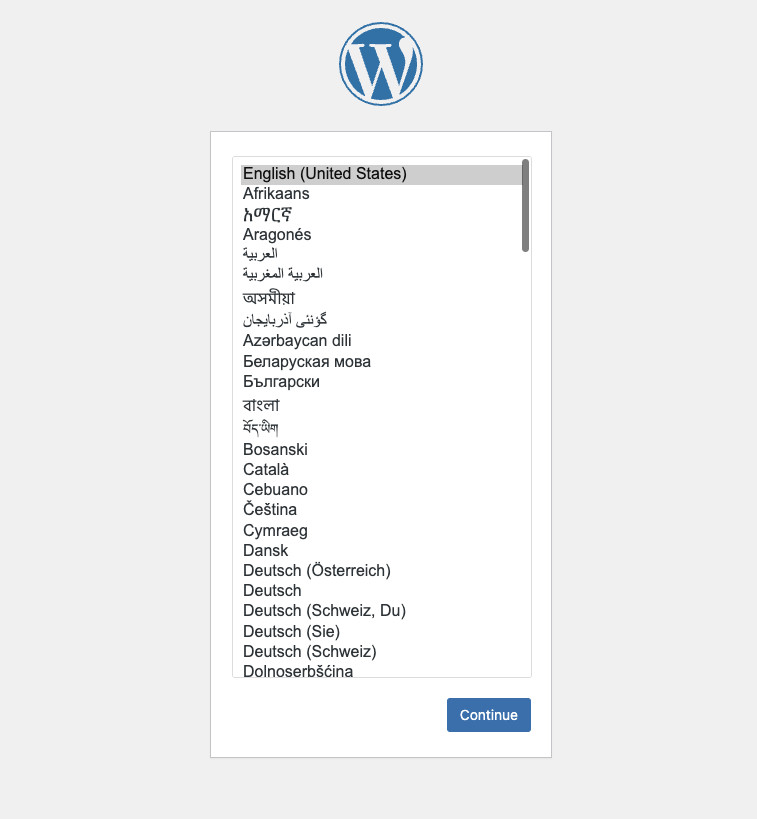

# Docker SQLite WordPress


WordPress with SQLite, ready to use out of the box.

- Based on [official image](https://hub.docker.com/_/wordpress), Easier and more sustainable solution.
- DockerHub Page: https://hub.docker.com/r/soulteary/sqlite-wordpress

## Articles

- [WordPress SQLite Docker image packaging details](https://soulteary.com/2024/04/21/wordpress-sqlite-docker-image-packaging-details.html)
- [WordPress farewell to MySQL: Docker SQLite WordPress](https://soulteary.com/2024/04/17/say-goodbye-to-mysql-docker-sqlite-wordpress.html)

## Quick Start

You can download GitHub's clean and secure docker image using the following command:

```bash
# use latest
docker pull soulteary/sqlite-wordpress
# use specify version
docker pull soulteary/sqlite-wordpress:6.5.2
```

Use the following command to quickly launch the wordpress with port `8080`:

```bash
docker run --rm -it -p 8080:80 -v `pwd`/wordpress:/var/www/html soulteary/sqlite-wordpress
```

You can also use docker compose to start wordpress:

```yaml
version: '3'

services:

  wordpress:
    image: soulteary/sqlite-wordpress:6.5.2
    restart: always
    ports:
      - 8080:80
    volumes:
      - ./wordpress:/var/www/html
```

Save the file as `docker-compose.yml` and then execute `docker compose up`, then use browser access to `localhost:8080`.



Use the quick 1-minute initial installation, enjoy.
