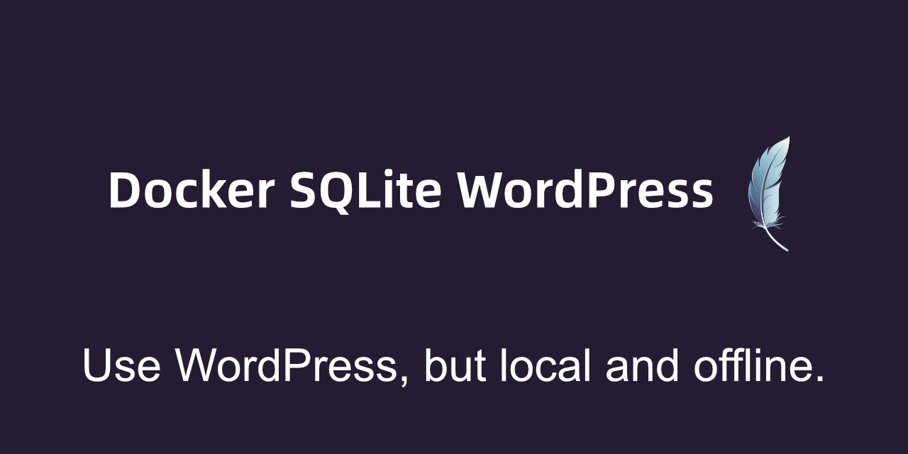
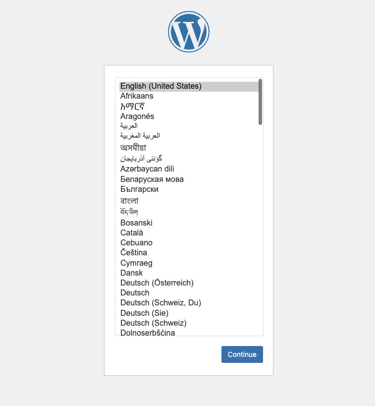

# Docker SQLite WordPress



WordPress with SQLite, ready to use out of the box.

- Based on [official image](https://hub.docker.com/_/wordpress), Easier and more sustainable solution.
- DockerHub Page: https://hub.docker.com/r/soulteary/sqlite-wordpress
- GHCR Page: https://github.com/soulteary/docker-sqlite-wordpress/pkgs/container/sqlite-wordpress
- Ships the optional native [`wp_mysql_parser`](https://wordpress.github.io/sqlite-database-integration/native-extension/) PHP extension for a faster MySQL lexer/parser path.

## Native MySQL Parser Extension

The image bundles WordPress `7.1.0` on PHP 8.5/Apache and [`sqlite-database-integration`](https://github.com/WordPress/sqlite-database-integration) `v3.0.0` together with its optional native Rust extension `wp_mysql_parser`. The extension is compiled and enabled on `amd64` and `arm64`; published 32-bit ARM variants use the plugin's pure-PHP fallback. The SQLite driver detects the available implementation automatically (the upstream project reports roughly 4.8x faster lexing and 15.5x faster parsing for the native path).

Verify it is loaded inside the container:

```bash
docker exec -it <container> php -m | grep wp_mysql_parser
```

## SQLite Diagnostics Page

The image bundles a read-only diagnostics must-use plugin, `sqlite-diagnostics.php`, dropped into `wp-content/mu-plugins/`. It adds a **Tools → SQLite Diagnostics** page (visible to administrators with the `manage_options` capability) that gathers the SQLite runtime state into one place: whether the native `wp_mysql_parser` extension is loaded and which parse path is active, the SQLite version and source id, PHP/architecture and `pdo_sqlite` details, the SQLite drop-in version and database file path/size, and the bundled `sqlite-database-integration` plugin version. It also detects the native lexer and parser independently, reads key PRAGMA values (journal mode, synchronous, page/cache sizes, foreign keys, etc.) from the live site connection, and breaks down on-disk storage into the main file plus its WAL and SHM sidecars and their combined total. The page performs no writes and probes the SQLite version through an in-memory database, so the live site database is never modified.

Cross-check the same values from the CLI inside the container:

```bash
docker exec -it <container> php -m | grep wp_mysql_parser
docker exec -it <container> php -r 'echo (new PDO("sqlite::memory:"))->query("SELECT sqlite_version()")->fetchColumn(), PHP_EOL;'
docker exec -it <container> php -r 'echo (new PDO("sqlite::memory:"))->query("SELECT sqlite_source_id()")->fetchColumn(), PHP_EOL;'
```

## SELECT id Key Case Fix

The image also bundles a small companion must-use plugin, `sqlite-select-id-key-fix.php`, dropped into `wp-content/mu-plugins/`. WordPress auto-loads files in the mu-plugins root, so it is always active and cannot be accidentally disabled.

It works around a difference between MySQL and SQLite: MySQL echoes back the identifier casing written in the query (e.g. `SELECT P.id` yields the key `id`), while SQLite returns the real declared column name (e.g. `ID`) for an un-aliased column. That mismatch leaves `$item['id']` / `$row->id` empty in some code paths. The plugin conservatively restores the written casing for safe single-table `SELECT` results (`ARRAY_A` / `OBJECT`), leaving anything it cannot fully reason about untouched.

Verify it is present inside the container:

```bash
docker exec -it <container> ls -l /var/www/html/wp-content/mu-plugins/
```

## Articles

- [WordPress SQLite Docker image packaging details](https://soulteary.com/2024/04/21/wordpress-sqlite-docker-image-packaging-details.html)
- [WordPress farewell to MySQL: Docker SQLite WordPress](https://soulteary.com/2024/04/17/say-goodbye-to-mysql-docker-sqlite-wordpress.html)

## Quick Start

You can download GitHub's clean and secure docker image using the following command:

```bash
# Docker Hub: use latest
docker pull soulteary/sqlite-wordpress
# Docker Hub: use specify version
docker pull soulteary/sqlite-wordpress:7.1.0
# GHCR: use latest
docker pull ghcr.io/soulteary/sqlite-wordpress:latest
# GHCR: use specify version
docker pull ghcr.io/soulteary/sqlite-wordpress:7.1.0
```

Use the following command to quickly launch the wordpress with port `8080`:

```bash
docker run --rm -it -p 8080:80 -v "$(pwd)/wordpress:/var/www/html" soulteary/sqlite-wordpress
# or use GHCR
docker run --rm -it -p 8080:80 -v "$(pwd)/wordpress:/var/www/html" ghcr.io/soulteary/sqlite-wordpress:latest
```

You can also use docker compose to start wordpress:

```yaml
services:

  wordpress:
    image: soulteary/sqlite-wordpress:latest
    # or use: ghcr.io/soulteary/sqlite-wordpress:7.1.0
    restart: always
    ports:
      - 8080:80
    volumes:
      - ./wordpress:/var/www/html
```

Save the file as `docker-compose.yml` and then execute `docker compose up`, then use browser access to `localhost:8080`.



Use the quick 1-minute initial installation, enjoy.

## Deployment Suitability and Migration Boundary

This image is intended for new WordPress installations and sites that already
use SQLite. It is **not** a MySQL or MariaDB migration tool. Pointing an existing
MySQL-backed WordPress volume at this image does not copy its database; the
SQLite integration starts from a separate SQLite database. Migrate the content
with a dedicated, verified migration workflow before switching images.

SQLite supports concurrent readers but only one writer at a time. It is a good
fit for local development and many small or read-heavy sites, but MySQL or
MariaDB may be more appropriate for workloads with sustained concurrent writes.
Before production use, test the expected traffic, themes, plugins, scheduled
jobs, and backup/restore procedure. See the upstream
[`sqlite-database-integration` production and migration guidance](https://github.com/WordPress/sqlite-database-integration/blob/v3.0.0/packages/plugin-sqlite-database-integration/readme.txt)
for the underlying compatibility boundary.

## Emergency Site URL Recovery Tool

> **Availability:** this tool was added to `main` after the immutable `7.1.0`
> release. The published `7.1.0` and current `latest` images do not contain it.
> Until the next release, build the current repository and use a local image:
>
> ```bash
> docker build -t sqlite-wordpress:site-url-recovery .
> ```

The image includes `/tool-update-site-url.php` for recovering a site after an
incorrect domain, scheme, port, or subdirectory was saved in WordPress. The
standalone page remains reachable even when the normal site or `wp-admin`
redirects to the old address. It updates both settings in one SQLite
transaction:

- **WordPress Address (URL)** → the `siteurl` option (where WordPress core files
  are located).
- **Site Address (URL)** → the `home` option (the public visitor-facing URL).

### Security model

The endpoint is disabled by default and returns `404 Not Found` unless both of
these independent conditions are met:

1. `WORDPRESS_SITE_URL_UPDATE_TOOL_ENABLED` is set to the exact lowercase value
   `true`.
2. Exactly one strong recovery credential is configured.

Values such as `1`, `yes`, or `TRUE` do not enable the tool. A Docker secret is
preferred for the token so it does not appear in `docker inspect` output.
Choose exactly one of these credential sources:

| Variable | Minimum length | Notes |
| --- | ---: | --- |
| `WORDPRESS_SITE_URL_UPDATE_TOKEN_FILE` | 32 characters | Preferred. Reads a Docker secret or mounted file. |
| `WORDPRESS_SITE_URL_UPDATE_TOKEN` | 32 characters | Direct token; visible in container environment metadata. |
| `WORDPRESS_SITE_URL_UPDATE_PASSWORD` | 24 characters | Direct password; visible in container environment metadata. Use a generated value or long passphrase. |

The generic variable `PASSWORD` is intentionally ignored to avoid collisions
with unrelated software. Do not configure more than one source at the same
time.

Authentication is globally throttled across all PHP workers. Five failed
credentials within 15 minutes lock the endpoint for 15 minutes and return
`429 Too Many Requests`. A correct credential reserves one operation for five
minutes so concurrent requests cannot reuse it. Immediately before the SQLite
write, that authorization is permanently consumed: the current PHP worker sets
`WORDPRESS_SITE_URL_UPDATE_TOOL_ENABLED=false`, removes its credential values,
and writes a one-shot state file beside the SQLite database. Other workers and
container restarts continue returning `404`, even though an application cannot
rewrite Docker's configured environment.

The global lock prevents distributed guessing without trusting forwarded IP
headers, but an exposed attacker could deliberately trigger the temporary
lockout. Keep the endpoint on a private network or IP allowlist and add reverse
proxy rate limiting when it must be internet-reachable. Always use TLS outside
the local machine.

### Preferred TOKEN_FILE example

Create a random token file:

```bash
mkdir -p secrets
openssl rand -hex 32 > secrets/site-url-update-token
chmod 600 secrets/site-url-update-token
```

```yaml
services:

  wordpress:
    build: .
    image: sqlite-wordpress:site-url-recovery
    ports:
      - 8080:80
    environment:
      WORDPRESS_SITE_URL_UPDATE_TOOL_ENABLED: "true"
      WORDPRESS_SITE_URL_UPDATE_TOKEN_FILE: /run/secrets/site-url-update-token
    secrets:
      - site-url-update-token
    volumes:
      - ./wordpress:/var/www/html

secrets:
  site-url-update-token:
    file: ./secrets/site-url-update-token
```

### PASSWORD Compose example

`WORDPRESS_SITE_URL_UPDATE_PASSWORD` is intended only for short-lived local or
otherwise network-restricted recovery. Generate and export a fresh value rather
than committing it to Compose or `.env`:

```bash
export WORDPRESS_SITE_URL_UPDATE_PASSWORD="$(openssl rand -base64 24)"
```

```yaml
services:

  wordpress:
    build: .
    image: sqlite-wordpress:site-url-recovery
    ports:
      - 8080:80
    environment:
      WORDPRESS_SITE_URL_UPDATE_TOOL_ENABLED: "true"
      WORDPRESS_SITE_URL_UPDATE_PASSWORD: "${WORDPRESS_SITE_URL_UPDATE_PASSWORD:?export a recovery password first}"
    volumes:
      - ./wordpress:/var/www/html
```

The repository's [`docker-compose.yml`](./docker-compose.yml) contains the same
PASSWORD settings with safe disabled/empty defaults and commented TOKEN_FILE
alternatives. Because direct passwords appear in `docker inspect`, prefer the
TOKEN_FILE example for shared hosts.

### Recovery workflow and automatic shutdown

1. Back up `wp-content/database/`.
2. Configure the exact enable value `true` and exactly one credential, then
   recreate the container.
3. Open `http://localhost:8080/tool-update-site-url.php`. Enter the credential
   and both new addresses. The credential is accepted only in the POST body;
   never append it to the URL.
4. Verify both the public site and `wp-admin` at their new addresses. The first
   authenticated write attempt consumes the authorization and automatically
   hides the endpoint. This remains true even if the database update reports an
   error, so inspect the container logs and current option values before doing
   anything else.
5. Remove `WORDPRESS_SITE_URL_UPDATE_TOOL_ENABLED` and the selected credential
   from Compose, then recreate the container. This disabled start clears the
   internal used-state file while keeping the endpoint disabled.

To deliberately rearm the tool later, first start the container once with the
enable setting removed or set to `false`. Then configure a new credential, set
the exact value `true`, and recreate it again. Merely restarting with the same
enabled configuration never clears a consumed authorization.

The managed latch is
`wp-content/database/.ht.site-url-update-tool-state`. Do not delete or edit it
while the endpoint is enabled; the entrypoint removes it safely during the
documented disabled start.

### Accepted URL rules

| Rule | Accepted examples / behavior |
| --- | --- |
| Absolute HTTP(S) URL | `https://example.com`, `http://localhost:8080` |
| Optional port or subdirectory | `https://example.com:8443/wordpress` |
| Local and private hosts | Localhost, private IPv4, and bracketed IPv6 addresses are accepted. |
| Internationalized hostnames | Use their ASCII/Punycode form. |
| Trailing slash | Removed before the option is stored. |
| Rejected components | Embedded username/password, query string, fragment, whitespace, backslash, or `.` / `..` path segments. |

Both fields are required even when their values are identical. Use different
values only when WordPress core is installed in a subdirectory, for example
`siteurl=https://example.com/wordpress` and `home=https://example.com`.

### Troubleshooting

Check detailed server-side errors with `docker compose logs wordpress`. The
endpoint intentionally avoids returning sensitive configuration details.

| HTTP status | Meaning | Action |
| ---: | --- | --- |
| `404` | Disabled, missing credential, or one-shot authorization already used. | Check the exact enable value and follow the deliberate rearm sequence if a previous attempt consumed it. |
| `403` | Invalid credential before the failure threshold. | Check the selected TOKEN_FILE, TOKEN, or PASSWORD source; do not configure multiple sources. |
| `405` | Unsupported request method. | Open with GET and submit the form with POST. |
| `409` | Another authenticated request is active, Multisite is enabled, or `WP_HOME` / `WP_SITEURL` overrides the database. | Wait for the active request, or correct the unsupported WordPress configuration. |
| `422` | A submitted URL failed validation. | Apply the accepted URL rules above and submit both fields again. |
| `429` | Five failed credentials triggered the 15-minute global lockout. | Wait for `Retry-After`, inspect logs, and restrict network access before retrying. |
| `500` | The atomic SQLite update failed after the one-shot authorization was consumed. | Inspect logs and both option values, then deliberately rearm only if another attempt is required. |
| `503` | Invalid credential configuration, unreadable state/database directory, or missing WordPress runtime. | Check logs, file mounts, permissions, and mutually exclusive credential settings. |

The tool intentionally refuses WordPress Multisite installations. It also
refuses to write when `WP_HOME` or `WP_SITEURL` is defined in `wp-config.php`,
because those constants override the database values; update or remove the
constants instead.

## Volume and Upgrade Notes

Back up `wp-content/database/` before upgrading an existing site to the
WordPress 7.1.0 / SQLite Database Integration 3.0.0 image. Version 3.0.0
requires a non-empty `DB_NAME` in custom `wp-config.php` files and uses WAL
journaling by default, so the database's `-wal` and `-shm` sidecar files must
remain on the same persistent volume as the main SQLite file.

### Safe Backup and Restore

Do not copy only the main SQLite file while WordPress is running. Stop the
container first so the database and its WAL sidecars form one consistent
snapshot. For the repository's default `./wordpress` bind mount:

```bash
mkdir -p backups
backup_archive="backups/wordpress-database-$(date -u +%Y%m%dT%H%M%SZ).tar.gz"
docker compose stop wordpress
tar -C ./wordpress/wp-content -czf "${backup_archive}" database
docker compose start wordpress
```

For a named volume, replace `<wordpress-volume>` with the volume mounted at
`/var/www/html`:

```bash
mkdir -p backups
wordpress_volume="replace-with-your-wordpress-volume-name"
docker compose stop wordpress
docker run --rm \
  --entrypoint tar \
  --mount "type=volume,source=${wordpress_volume},target=/source,readonly" \
  --mount type=bind,source="$(pwd)/backups",target=/backup \
  soulteary/sqlite-wordpress:7.1.0 \
  -C /source/wp-content -czf /backup/wordpress-database.tar.gz database
docker compose start wordpress
```

Restore only while the container is stopped. Keep the current directory as a
recoverable rollback copy instead of deleting it:

```bash
backup_archive="backups/replace-with-your-backup.tar.gz"
docker compose stop wordpress
mv ./wordpress/wp-content/database ./wordpress/wp-content/database.before-restore
tar -C ./wordpress/wp-content -xzf "${backup_archive}"
docker compose up -d
```

For a named volume, use the same image to retain the current database as a
rollback directory before extracting the archive:

```bash
wordpress_volume="replace-with-your-wordpress-volume-name"
docker compose stop wordpress
docker run --rm \
  --entrypoint bash \
  --mount "type=volume,source=${wordpress_volume},target=/source" \
  --mount type=bind,source="$(pwd)/backups",target=/backup,readonly \
  soulteary/sqlite-wordpress:7.1.0 \
  -ceu 'test ! -e /source/wp-content/database.before-restore
        mv /source/wp-content/database /source/wp-content/database.before-restore
        tar -C /source/wp-content -xzf /backup/wordpress-database.tar.gz'
docker compose up -d
```

After a restore, verify the database through the active WordPress SQLite driver:

```bash
docker compose exec wordpress php -r '
require "/var/www/html/wp-load.php";
$pdo = $GLOBALS["wpdb"]->get_driver()->get_sqlite_pdo();
$result = $pdo->query("PRAGMA integrity_check")->fetchColumn();
fwrite(STDOUT, $result . PHP_EOL);
exit("ok" === $result ? 0 : 1);
'
```

Backups include the recovery tool's internal state files. After restoring or
cloning a volume, keep the tool disabled during the first container start so its
one-shot state is safely reset before any future recovery session.

These examples protect the SQLite database only. Back up uploads, themes,
plugins, and custom configuration separately when a full site restore is
required.

### SQLite Database Integration 3.0 Compatibility

Custom configurations should also review the upstream
[`3.0.0` breaking changes](https://github.com/WordPress/sqlite-database-integration/blob/v3.0.0/packages/plugin-sqlite-database-integration/readme.txt).
In particular, `WP_SQLITE_AST_DRIVER` and `DATABASE_ENGINE` were removed;
`DATABASE_TYPE`, `FQDBDIR`, and `FQDB` are deprecated; and integrations that
used the old driver classes or `$GLOBALS['@pdo']` must move to the public v3
driver APIs. These considerations apply to custom `wp-config.php` files and
plugins; the image's bundled defaults already use the v3 layout.

This image is **self-healing**: its entrypoint reconciles the SQLite drop-in
(`wp-content/db.php`) and the SQLite must-use plugins into the live document
root on **every** container start, regardless of the mounted volume's state.

This matters because the stock WordPress entrypoint only seeds a mounted volume
from the image's `/usr/src/wordpress` when the volume looks empty (missing
`index.php` / `wp-includes/version.php`). An **old, already-initialized**
`./wordpress` volume (for example one created by a previous image version, or a
reused named volume) would otherwise **never** receive the SQLite drop-in, so
WordPress would fall back to MySQL and show "Error establishing a database
connection". The bundled entrypoint fixes this by copying `db.php` and the
SQLite mu-plugins in on start when they are missing or stale — no manual volume
reset is required when upgrading.

Verify the SQLite drop-in is present inside the container:

```bash
docker exec -it <container> ls -l /var/www/html/wp-content/db.php
```

## Contributing

Contributions are welcome! Please read the [Contributing Guide](./CONTRIBUTING.md) and the [Code of Conduct](./CODE_OF_CONDUCT.md) before getting started.

## Security

Found a security issue? Please review our [Security Policy](./SECURITY.md) and report it privately instead of opening a public issue.
